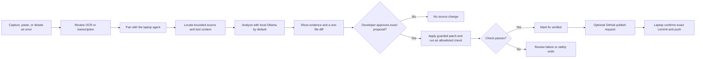

# PocketPilot AI

**See the error. Review the fix. Keep control.**

[](https://github.com/pavansai20052004-hue/pocketpilot-city-battle-2026/actions/workflows/quality.yml)
[](https://github.com/pavansai20052004-hue/pocketpilot-city-battle-2026/actions/workflows/mobile-apk.yml)

PocketPilot is a phone-first debugging companion for developers working at a laptop. Capture or dictate an error on Android, inspect the relevant evidence on the paired laptop, and review a one-file fix before the agent changes code or runs a project check.

This is the City Battle 2026 implementation. The earlier PocketPilot prototype informed the product direction; this repository contains a new event implementation.

## Release status

| Track | Version | Status |
| --- | --- | --- |
| PocketPilot source | **1.1.0** | Release candidate in this repository; not published as a GitHub or Play Store release |
| Android | **1.1.0 · versionCode 11** | Build and physical-device acceptance are required before distribution |
| Last documented device run | 1.0.9 · versionCode 10 | The Python repair, passing check, undo flow, and Pilot conversation were exercised on an iQOO on 26 September 2026. This does not verify the 1.1.0 candidate. |

The Android Actions workflow creates a downloadable release-variant APK for evaluation and retains it for seven days. It does not publish a GitHub Release or sign an app for Google Play. See the [changelog](CHANGELOG.md) and [release checklist](docs/RELEASING.md).

## How the workflow works



The model proposes a change; it never supplies a shell command. PocketPilot marks a fix **verified** only after the selected project check exits successfully. Undo checks the file hash before restoring the saved version, so a later edit is not silently overwritten.

## What is implemented

- **Phone capture:** camera or selected screenshot with on-device OCR, editable error text, and Android on-device speech recognition when the language model is installed.
- **Bounded project context:** the laptop indexes supported source files and selects a small number of relevant source, test, and related-code chunks. It does not upload a whole repository.
- **Root-cause analysis:** the configured model explains the failure, evidence, and repair strategy. The workspace matcher establishes the source location; the displayed high/low label describes that source match, not a calibrated score of diagnosis correctness.
- **Review before changes:** the agent validates an exact, single-file replacement and displays its diff. The file is unchanged until the developer approves that proposal.
- **Real project checks:** after approval, the agent runs a narrowly allowlisted check for supported Python, Java, C#, JavaScript, or TypeScript projects. Unsupported or ambiguous setups remain unverified.
- **Recovery:** guarded undo restores the captured source only when the patched file has not changed again.
- **Pilot:** a text and voice companion explains the active session. It has no tools or write access; its short chat history stays in laptop memory and can be cleared.
- **Optional model routing:** Ollama on the laptop is the default. The desktop operator can opt into OpenRouter for analysis, proposals, and Pilot. The UI discloses cloud processing; common secrets are redacted on a best-effort basis, not guaranteed removed.
- **Careful GitHub publishing:** after a passing check, the phone can request publication of the verified file from an existing local Git checkout. The laptop displays the exact repository, branch, file, and commit, then requires a separate desktop confirmation. Credentials remain on the laptop.

See [agent documentation](services/agent/README.md) for supported project manifests, API behavior, privacy boundaries, and recovery details.

## Product scope and roadmap

The current implementation works with a locally selected project folder and its existing Git remote. It does not provide Google sign-in, OAuth, remote repository browsing/cloning, or a managed account system. Pairing uses a temporary code and an in-memory bearer token on a trusted local network.

The current analysis shows a model-provided confidence label alongside repository evidence. It does not implement a separate Matrix Analysis engine, calibrated LLM score, or formal logical-consistency evaluator. Those ideas from the product brief are future work; they are not claims about version 1.1.0.

## Architecture

| Path | Responsibility |
| --- | --- |
| `apps/mobile` | Expo / React Native Android app |
| `apps/desktop-web` | Vite dashboard for workspace selection, pairing, provider settings, and desktop publish confirmation |
| `services/agent` | FastAPI laptop agent, bounded context selection, provider calls, patch approval, project checks, undo, and Git publishing |
| `packages/shared-types` | Shared TypeScript contracts for the dashboard and agent API |
| `demo` | Small language fixtures for source-location and verification flows |
| `tools` | Local laptop startup helpers |

## Run locally

### Requirements

- Node.js 24 or newer and npm 11 or newer
- Python 3.11 or newer
- Ollama with the configured model for local inference, or an OpenRouter key entered on the laptop dashboard
- For Android source builds: Android SDK and Java 21
- A phone and laptop on the same trusted private Wi-Fi network for device pairing

### Install and start the laptop services

From the repository root:

```powershell
npm ci
cd services/agent
py -m venv .venv
.\.venv\Scripts\python.exe -m pip install -e ".[dev]"
cd ..\..
npm run start:local
```

`start:local` builds the dashboard when needed and starts the dashboard and local agent. Keep this terminal open while using services it started. The dashboard is at `http://127.0.0.1:4173`; the phone must use the laptop's LAN address and port `8000`, not `127.0.0.1`.

For macOS/Linux, create the virtual environment with `python3 -m venv services/agent/.venv`, install with `services/agent/.venv/bin/python -m pip install -e './services/agent[dev]'`, then run `npm run start:local`.

### Start the Android app

In a second terminal, run `npm run dev:mobile` for Expo development. To build and launch the native Android app locally, install the Android SDK, connect a device or start an emulator, then run `npm run android --workspace=@pocketpilot/mobile`. The phone and laptop need to be on a trusted private network. Pair from the app using the LAN address shown in the desktop dashboard.

For a ready-to-install evaluation APK, open the latest successful **Build PocketPilot Android APK** workflow and download its `pocketpilot-android-apk` artifact. Artifacts are temporary and are not published releases.

## Quality checks

```powershell
npm run check
cd services/agent
.\.venv\Scripts\python.exe -m pytest -q
.\.venv\Scripts\python.exe -m ruff check src tests
.\.venv\Scripts\python.exe -m ruff format --check src tests
```

The `Quality checks` workflow runs the frontend checks and backend test/lint checks on pull requests and pushes to `main`.

## Privacy and safety

- The phone communicates with the laptop over local HTTP. Pair only on trusted Wi-Fi; this event build is not designed for public or untrusted networks.
- Ollama prompts stay on the laptop. With OpenRouter selected, reviewed error text, bounded matched source context, fix instructions, and Pilot context are sent to that provider. Review inputs and do not submit credentials or code you are not authorized to share.
- Credential redaction is best effort and cannot guarantee every secret is removed. OpenRouter keys are held in agent memory until restart and are not stored in the app or repository.
- The model cannot approve a patch, run arbitrary commands, or publish code. Project checks execute project code; only select workspaces you trust.
- GitHub publishing uses the laptop's existing Git credentials and requires an explicit laptop-side confirmation. Published commits cannot be undone through PocketPilot.

Read the [security policy](SECURITY.md) and the detailed [agent boundaries](services/agent/README.md) before pairing a device or enabling cloud inference.

## Contributing

See [CONTRIBUTING.md](CONTRIBUTING.md) for setup, code checks, and pull request expectations.
